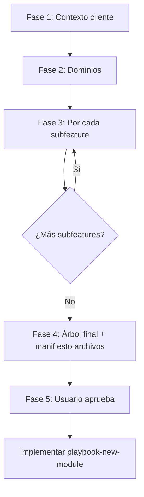

# Guía de mapeo de features de cliente (humano + agente IA)

Documento para **descubrir el negocio del cliente** y traducirlo a carpetas bajo `src/features/`, **sin tocar el chasis** (auth, RBAC, layouts, `is_god()`, `DataTable`, `useCrudResource`).

**Uso recomendado:** un agente IA hace preguntas por fases, va llenando la [ficha de mapeo](#ficha-de-mapeo-plantilla) y al final entrega el **árbol de carpetas + lista de archivos** antes de escribir código.

**Kit listo para pegar en tu IA:** [feature-specs/agent/README.md](./feature-specs/agent/README.md) (system prompt + generador + contrato de salida).

**Después de mapear:** implementar con [**playbook-new-module.md**](./playbook-new-module.md) (SQL → tipos → hook → page → ruta → RBAC).

---

## Modo de trabajo para el agente IA

### Reglas del agente

1. **Una fase a la vez** — no saltar a código hasta tener la ficha de la subfeature completa.
2. **Confirmar con el usuario** cada decisión de árbol (dominio → subfeature → ¿más anidación?).
3. **No modificar el chasis** — solo proponer archivos bajo `src/features/<dominio>/`.
4. **Un modelo, una verdad** — un `.ts` canónico por entidad en `types/`; sin `*DTO` ni `*Payload`.
5. **Preguntar ámbito** en cada subfeature: ¿workspace (`entity_id`) o global (`/settings`, `/finanzas`)?

### Flujo de conversación sugerido



### Salida esperada del mapeo (antes de codear)

Entregar al usuario:

1. **Árbol ASCII** de `src/features/`.
2. **Tabla de subfeatures** (nombre, ruta URL, workspace sí/no, resourceCode propuesto).
3. **Manifiesto de archivos** por subfeature (lista de paths a crear).
4. **Ficha YAML** rellena (plantilla abajo) guardada en `docs/feature-specs/<cliente>-mapping.yaml` si el equipo lo desea.

---

## Fase 1 — Contexto del cliente

Preguntas que el agente debe hacer:

| # | Pregunta | Para qué |
|---|----------|----------|
| 1.1 | ¿Nombre del cliente / proyecto? | Prefijo de specs y commits |
| 1.2 | ¿Qué es una **entidad** en su lenguaje? (obra, proyecto, caso…) | `VITE_ENTITY_LABEL`; filtros `entity_id` |
| 1.3 | ¿Un usuario ve **todas** las entidades o solo las asignadas? | RLS + `sys_entity_access` |
| 1.4 | ¿Qué módulos del **chasis** se quedan? (usuarios, roles, tareas, ecommerce…) | Flags `.env` |
| 1.5 | ¿Módulos **nuevos** de negocio a digitalizar? (lista de áreas) | Dominios top-level |

**Criterio de cierre:** lista de dominios nuevos (ej. `finanzas`, `operaciones`, `comercial`).

---

## Fase 2 — De dominio a árbol de carpetas

Por cada **dominio** (ej. `finanzas`), el agente pregunta:

| # | Pregunta | Decisión |
|---|----------|----------|
| 2.1 | ¿Este dominio necesita **dashboard propio** en menú? | `pages/<Dominio>DashboardPage.tsx` + ruta `/finanzas` o solo subfeatures |
| 2.2 | ¿Qué **bloques** de negocio son independientes (menú, permisos, equipo distinto)? | Subfeatures de primer nivel (`ingresos`, `egresos`) |
| 2.3 | ¿Algún bloque tiene **hijos** con vida propia? | Subfeature anidada (`egresos/contratos`) |
| 2.4 | ¿Algo es solo **detalle de pantalla** (líneas, adjuntos, comentarios)? | Solo `components/`, **no** carpeta subfeature |

### Árbol canónico (plantilla)

```
src/features/<dominio>/
  navigation.ts          ← opcional
  pages/
  hooks/
  components/
  types/
  <subfeature-A>/
    pages/ hooks/ components/ types/
  <subfeature-B>/
    ...
    <subfeature-B-hija>/
      pages/ hooks/ components/ types/
```

**Nombres:** carpetas en `minúsculas-kebab` o `minúsculas` (`egresos`, `contratos`). Sin espacios ni mayúsculas en paths.

### ¿Subfeature o solo componente?

| Sí es subfeature | No es subfeature (solo componente) |
|------------------|-----------------------------------|
| Entrada propia en sidebar | Tab dentro de una página |
| `resourceCode` / permiso propio | Solo campos del formulario |
| CRUD o listado propio | Tabla hija embebida |
| Otro rol puede tener acceso sin ver el padre | Datos calculados en la misma pantalla |

---

## Fase 3 — Ficha por subfeature (repetir N veces)

Por **cada** subfeature (ej. `finanzas/egresos/contratos`), el agente completa esta tabla con el usuario.

### 3.1 Identidad

| Campo | Ejemplo `contratos` | Pregunta al usuario |
|-------|---------------------|---------------------|
| `dominio` | `finanzas` | ¿Bajo qué dominio vive? |
| `subfeature_path` | `egresos/contratos` | Ruta de carpetas desde el dominio |
| `nombre_ui` | Contratos | ¿Cómo aparece en el menú? |
| `descripcion` | Contratos con proveedores por obra | Una frase |

### 3.2 Ámbito y navegación

| Campo | Opciones | Pregunta |
|-------|----------|----------|
| `ambito` | `workspace` \| `global` | ¿Los datos son por obra/entity o de toda la empresa? |
| `ruta_url` | `contratos` (workspace) o `/finanzas/contratos` (global) | ¿URL deseada? |
| `layout` | `workspace` \| `app` | Derivado del ámbito |
| `grupo_sidebar` | `workspace` \| nuevo grupo `finanzas` | ¿Dónde va en el menú? |
| `depende_entity` | `true` / `false` | ¿Filtra por `entity_id`? |

**Workspace:** ruta final `/workspace/:entityId/contratos` → registro en `WORKSPACE_ROUTES`.  
**Global:** ruta `/finanzas/contratos` → registro en `APP_ROUTES`.

### 3.3 Datos (modelo canónico)

| Campo | Ejemplo | Pregunta |
|-------|---------|----------|
| `entidad` | `Contrato` | ¿Nombre del concepto en singular? |
| `tabla_sql` | `contratos` | ¿Nombre de tabla en Postgres? |
| `archivo_types` | `src/features/finanzas/egresos/contratos/types/contrato.ts` | Siempre bajo la subfeature |
| `extiende_audit` | `true` | Casi siempre sí (manifiesto Pragmata) |
| `campos` | lista campo → tipo | ¿Qué columnas de negocio? |
| `relaciones` | `entity_id`, `proveedor_id` | ¿FKs? |

**Plantilla de campos (para la conversación):**

| campo | tipo TS | requerido | en listado | en formulario | notas |
|-------|---------|-----------|------------|---------------|-------|
| numero | string | sí | sí | sí | único por entity |
| monto_total | number | sí | sí | sí | |
| proveedor_nombre | string | no | sí | sí | |

### 3.4 Pantallas y UX

| Campo | Opciones | Pregunta |
|-------|----------|----------|
| `patron_ui` | `datatable_crud` \| `kanban` \| `wizard` \| `detalle` | ¿Cómo interactúan? |
| `paginas` | listado, nuevo, editar, detalle | ¿Qué pantallas? |
| `acciones` | create, read, update, delete, export | ¿RBAC acciones? |

**Patrón por defecto:** listado con `DataTable` + modal o página de alta/edición.

### 3.5 Seguridad (solo registrar — chasis no se toca)

| Campo | Ejemplo | Pregunta |
|-------|---------|----------|
| `resource_code` | `page_workspace_contratos` | Prefijo `page_workspace_` o `page_` + snake |
| `categoria_rbac` | `Finanzas` | Agrupador en roles |
| `roles_que_usan` | Contador, Director obra | ¿Quién entra? |

El agente **propone** el `resource_code`; la implementación lo añade a `src/config/security/resources.ts` + `pnpm db:sync`.

### 3.6 Cierre de ficha

Checklist antes de pasar a la siguiente subfeature:

- [ ] Ámbito workspace/global claro
- [ ] Ruta URL acordada
- [ ] Entidad + campos listados
- [ ] Patrón UI elegido
- [ ] `resource_code` propuesto
- [ ] Path `types/<entidad>.ts` definido

---

## Fase 4 — Manifiesto de archivos (kit completo)

Por cada subfeature, estos archivos son la **meta mínima** (ajustar si el patrón lo requiere).

### Ejemplo: `finanzas/egresos/contratos`

| Orden | Archivo | Responsabilidad |
|-------|---------|-------------------|
| 1 | `types/contrato.ts` | `interface Contrato extends AuditBase`, `createEmptyContrato()` |
| 2 | `types/contrato.schema.ts` | Zod del formulario (opcional mismo basename) |
| 3 | `hooks/useContratos.ts` | `useCrudResource` o hook custom + `entity_id` |
| 4 | `components/ContratoFormModal.tsx` | Formulario alta/edición |
| 5 | `pages/ContratosPage.tsx` | `DataTable` + modales; solo compone |
| 6 | `src/app/routes.config.ts` | Entrada lazy + `resourceCode` |
| 7 | `src/config/security/resources.ts` | Definición del recurso |
| 8 | `supabase/migrations/...` | Tabla + RLS (`is_god()` primero) |

**Árbol resultante:**

```
src/features/finanzas/
  navigation.ts                    # opcional: export const FINANZAS_ROUTES = [...]
  pages/FinanzasDashboardPage.tsx  # opcional
  hooks/ components/ types/

  ingresos/
    pages/ hooks/ components/ types/

  egresos/
    pages/ hooks/ components/ types/
    contratos/
      types/
        contrato.ts
        contrato.schema.ts
      hooks/
        useContratos.ts
      components/
        ContratoFormModal.tsx
      pages/
        ContratosPage.tsx
```

### Imports típicos (referencia para implementación)

```ts
// types/contrato.ts
import type { AuditBase } from '@/types/core/base';

// hooks/useContratos.ts
import { useCrudResource } from '@/lib/hooks/useCrudResource';
import type { Contrato } from '../types/contrato';

// pages/ContratosPage.tsx
import { DataTable } from '@/components/ui/DataTable';
import { useContratos } from '../hooks/useContratos';
```

```ts
// routes.config.ts (workspace)
const ContratosPage = lazy(() =>
  import('@/features/finanzas/egresos/contratos/pages/ContratosPage'),
);
// WORKSPACE_ROUTES: { path: 'contratos', element: ContratosPage, resourceCode: 'page_workspace_contratos', ... }
```

---

## Ficha de mapeo (plantilla)

Copiar este bloque **por subfeature** y rellenar en la conversación (o guardar como YAML).

```yaml
# docs/feature-specs/<cliente>-mapping.yaml
cliente: "Nombre Cliente"
entity_label: "Proyecto"  # VITE_ENTITY_LABEL

dominios:
  - id: finanzas
    label_ui: Finanzas
    carpeta: src/features/finanzas
    dashboard: true
    subfeatures:
      - id: ingresos
        path: ingresos
        label_ui: Ingresos
        ambito: workspace
        entidad: null  # o Ingreso si aplica
        pantallas: []
        resource_code: null

      - id: contratos
        path: egresos/contratos
        label_ui: Contratos
        ambito: workspace
        entidad: Contrato
        tabla_sql: contratos
        types_file: src/features/finanzas/egresos/contratos/types/contrato.ts
        patron_ui: datatable_crud
        ruta_url: contratos
        resource_code: page_workspace_contratos
        campos:
          - name: numero
            type: string
            required: true
          - name: monto_total
            type: number
            required: true
        archivos_a_crear:
          - src/features/finanzas/egresos/contratos/types/contrato.ts
          - src/features/finanzas/egresos/contratos/types/contrato.schema.ts
          - src/features/finanzas/egresos/contratos/hooks/useContratos.ts
          - src/features/finanzas/egresos/contratos/components/ContratoFormModal.tsx
          - src/features/finanzas/egresos/contratos/pages/ContratosPage.tsx
        chasis_touches:
          - src/app/routes.config.ts
          - src/config/security/resources.ts
          - supabase/migrations/<timestamp>_contratos.sql
```

---

## Preguntas rápidas del agente (cheat sheet)

Usar en bloques; no disparar las 30 de golpe.

**Descubrimiento**

- «¿Qué proceso hacen hoy con [X] en papel o Excel?»
- «¿Quién lo crea, quién aprueba, quién solo consulta?»
- «¿Es por [entidad] o aplica a toda la empresa?»

**Árbol**

- «¿[X] merece su propia entrada en el menú y permisos, o es un tab de [Y]?»
- «¿Dentro de [Y] hay otro concepto con vida propia (ej. contratos dentro de egresos)?»

**Datos**

- «¿Qué campos son obligatorios en [entidad]?»
- «¿Hay archivos adjuntos, estados, o flujo tipo Kanban?»
- «¿Se borra o se archiva?» → siempre soft delete en Pragmata

**Cierre**

- «Resumo: carpeta `src/features/.../`, tabla `...`, ruta `...`, recurso `page_...`. ¿Confirmas?»

---

## Qué NO hace el mapeo (chasis intocable)

| No tocar | Dónde vive |
|----------|------------|
| Login, sesión, god user | `features/auth`, `lib/auth` |
| Motor RBAC (solo **añadir** códigos) | `resources.ts`, SQL `sys_resources` |
| Layout, sidebar, header | `components/layout` |
| `DataTable`, UI base | `components/ui` |
| `useCrudResource`, retry sesión | `lib/hooks` |
| Políticas RLS patrón | Migraciones (copiar patrón `is_god()` primero) |

---

## Después del mapeo — implementación

| Paso | Doc |
|------|-----|
| 1 | SQL + RLS → [playbook-new-module.md](./playbook-new-module.md) §1 |
| 2 | `types/` en la subfeature → §2 |
| 3 | `hooks/` → §3 |
| 4 | `pages/` + `components/` → §4–5 |
| 5 | `routes.config.ts` → §6 |
| 6 | RBAC + `pnpm db:sync` → §7 |
| 7 | Probar member + god → §10 |

Spec formal opcional: [feature-specs/FEATURE_SPEC_TEMPLATE.md](./feature-specs/FEATURE_SPEC_TEMPLATE.md).

---

## Referencias

| Tema | Documento |
|------|-----------|
| Visión negocio + workshop corto | [client-features-playbook.md](./client-features-playbook.md) |
| Mapa carpetas chasis | [erp-features-structure.md](./erp-features-structure.md) |
| Índice docs | [README.md](./README.md) |
