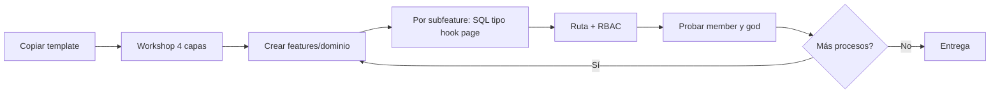

# Playbook: features de cliente (zona editable del ERP)

Guía para **clonar la template**, mapear el negocio del cliente y digitalizarlo sin tocar el motor de seguridad, auth ni layouts.

**Complementa (no reemplaza):** `docs/playbook-new-module.md` (pasos técnicos SQL → RBAC) y las reglas en `.cursor/rules/`.

---

## 1. Dos zonas del repositorio

| Zona | Qué es | Ejemplos en esta template |
|------|--------|---------------------------|
| **Chasis** | Motor fijo: permisos, god user, entity, layouts, UI base | `src/lib/`, `src/components/layout`, `src/app/`, `features/auth`, `entities` (selector), migraciones base, `resources.ts` |
| **Cliente / demo** | Lo que construyes por proyecto | `features/finanzas/`, `features/tasks/`, módulos que añadas tras el workshop |

Al copiar la template para un cliente:

1. Dejas el **chasis** (login, usuarios, roles, entities, workspace).
2. Apagas demos que no use con `VITE_ENABLE_*` en `.env`.
3. Creas **dominios nuevos** bajo `src/features/<dominio>/`.

---

## 2. Workshop con el cliente (4 capas)

| Capa | Preguntas | Salida |
|------|-----------|--------|
| **Proceso** | ¿Qué hacen cada día? ¿Quién aprueba? | Lista de procesos |
| **Dominio** | ¿Qué áreas agrupan esos procesos? | Carpetas top-level: `finanzas`, `operaciones`… |
| **Subfeature** | ¿Qué merece menú y permiso propios? | `ingresos`, `egresos/contratos` |
| **Ámbito** | ¿Los datos son por obra/proyecto (entity) o del equipo entero? | Workspace vs ruta global |

**Subfeature** = menú o `resourceCode` propio.  
**Solo componente** = detalle dentro de una pantalla (líneas, adjuntos) → `components/`, no otra carpeta raíz.

---

## 3. Árbol estándar por dominio

Nombres de carpeta en **minúsculas** (`finanzas`, no `Finanzas`). El label visible va en sidebar y en `APP_RESOURCES`.

```
src/features/<dominio>/
  pages/           # pantallas (lazy desde routes.config.ts)
  hooks/           # datos + reglas (useCrudResource o custom)
  components/      # modales, formularios, sub-vistas
  providers/       # opcional — contexto del dominio
  types/           # opcional — modelos solo de este dominio (ver §5)

  <subfeature>/    # mismo kit repetido
    pages/
    hooks/
    components/
    types/
```

No hace falta la carpeta literal `subfeatures/`; cada hijo con el mismo kit **ya es** una subfeature.

### Ejemplo cliente: Finanzas

```
src/features/finanzas/
  pages/FinanzasDashboardPage.tsx
  hooks/
  components/

  ingresos/
    pages/
    hooks/
    components/
    types/

  egresos/
    pages/
    hooks/
    components/
    contratos/
      pages/ContratosPage.tsx
      hooks/useContratos.ts
      components/
      types/contrato.ts
```

---

## 4. Dónde va cada pantalla (decisión rápida)

| Pregunta | Ubicación |
|----------|-----------|
| ¿Datos ligados al entity activo? | Ruta `/workspace/:entityId/...` + hook con `filter` por `entity_id` |
| ¿Configuración de todo el equipo? | Ruta `/settings/...` o `/finanzas/...` en layout `app` |
| ¿CRUD tabular simple? | `useCrudResource` + `DataTable` + modal en `components/` |
| ¿Kanban, wizard, varias tablas? | Hook dedicado en `hooks/` (patrón `useTasks`) |
| ¿Quién entra? | Nuevo código en `src/config/security/resources.ts` + `pnpm db:sync` |

Las **URLs públicas** no cambian al mover código: siguen definidas en `src/app/routes.config.ts`.

---

## 5. Modelos (types)

Regla del manifiesto: **un modelo, una verdad** (sin `*DTO`, `*Payload`, `*FormState`).

| Enfoque | Cuándo |
|---------|--------|
| **`src/types/<dominio>/`** | Chasis compartido y módulos demo de la template (recomendado mientras el tipo lo usan varios features) |
| **`features/<dominio>/types/`** | Módulo exclusivo del cliente; puedes re-exportar desde `src/types` si quieres un solo import público |

Los tipos de **props de UI** van junto al componente o en `components/types.ts` — no son el modelo de negocio.

---

## 6. Receta por pantalla nueva (checklist)

Repite por cada proceso digitalizado:

1. **SQL** — tabla con auditoría + RLS (`public.is_god()` primero).
2. **Tipo** — interface canónico (+ schema Zod derivado).
3. **Hook** — `useCrudResource` o custom con `withSessionRetry` + `sessionEpoch`.
4. **Components** — formularios, modales.
5. **Page** — `features/<dominio>/pages/MiPage.tsx` (solo compone).
6. **Ruta** — `routes.config.ts` con `lazy(() => import('@/features/...'))`.
7. **RBAC** — `APP_RESOURCES` + `pnpm db:sync`.
8. **Sidebar** — mismo `resourceCode` que la ruta.
9. **Pruebas** — member sin permiso, member con permiso, god.

Detalle técnico paso a paso: **`docs/playbook-new-module.md`**.

---

## 7. Registrar rutas (patrón)

```ts
// src/app/routes.config.ts
const ContratosPage = lazy(() =>
  import('@/features/finanzas/egresos/contratos/pages/ContratosPage'),
);

// WORKSPACE_ROUTES (si es por entity)
{
  path: 'contratos',
  name: 'Contratos',
  element: ContratosPage,
  layout: 'workspace',
  resourceCode: 'page_workspace_contratos',
},
```

Lazy **por página**, no por carpeta `finanzas` entera (bundle).

---

## 8. Fronteras de import (evitar spaghetti)

```
features/finanzas/egresos/contratos  →  puede usar hooks de egresos (padre)
                                    →  NO importar features/comercial directo
                                    →  SÍ @/lib, @/components/ui, @/types
```

- **Horizontal** entre dominios hermanos: prohibido.
- **Vertical** hacia el padre o al chasis: permitido.

---

## 9. Chasis de la template (referencia)

Módulos ya organizados en `src/features/`:

| Feature | Rol |
|---------|-----|
| `shell` | Entrada `/` → sitio Astro |
| `auth` | Login, callback, reset password |
| `dashboard`, `profile` | Inicio y perfil |
| `roles`, `users`, `entities` | Configuración (rutas `/settings/*`) |
| `tasks`, `workspace`, `documents` | Workspace por entity |
| `ecommerce`, `cms` | Demos opcionales (flags) |
| `chat`, `notifications`, `preferences` | Transversales |

Mapa vivo: **`src/features/README.md`**.

---

## 10. Flujo de proyecto



---

## Referencias

| Tema | Documento |
|------|-----------|
| Pasos SQL → RBAC | `docs/playbook-new-module.md` |
| Hooks y sesión | `.cursor/rules/05-secure-hooks.mdc` |
| Navegación / workspace | `.cursor/rules/06-navigation-layout.mdc` |
| DataTable / UI | `.cursor/rules/02-ui-components.mdc` |
| Ejemplo CRUD + Zod | `src/features/ecommerce/pages/ProductsPage.tsx` |
