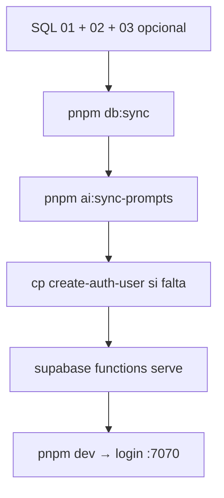

# Proceso local: scripts y Edge Functions (post migraciones 1, 2 y 3)

Guía **solo para Supabase en tu máquina** (`supabase start`). Tras el SQL de [**proceso-supabase-studio-local.md**](./proceso-supabase-studio-local.md), ejecutas scripts Node y **sirves** las Edge Functions en local.

> **Nube:** no uses `supabase functions deploy` aquí. Cuando tengas proyecto en Supabase cloud, sigue [SETUP.md §7](./SETUP.md#7-edge-functions--deploy) (`supabase link`, `secrets set`, `functions deploy`).

---

## Resumen (local)



| Orden | Comando / acción |
|-------|------------------|
| 0 | Migraciones SQL ([guía Studio](./proceso-supabase-studio-local.md)) |
| 1 | `pnpm install` (primera vez) |
| 2 | `SUPABASE_SERVICE_ROLE_KEY=... pnpm db:sync` |
| 3 | `pnpm ai:sync-prompts` |
| 4 | `supabase/functions/create-auth-user/` presente (copiar desde `scripts/` si falta) |
| 5 | **`supabase functions serve`** (terminal aparte, dejar corriendo) |
| 6 | `pnpm dev` → http://localhost:7070/login |

---

## 0. Prerrequisitos (local)

- `supabase start` en ejecución (Docker activo).
- `.env` en la raíz:

  ```env
  VITE_SUPABASE_URL=http://127.0.0.1:54321
  VITE_SUPABASE_ANON_KEY=<Publishable de supabase status>
  ```

- Migración **1** ya aplicada (al hacer `supabase start` suele bastar; si no, SQL `01` en Studio).
- Migración **2** con UUID del usuario Auth.
- Migración **3** solo si `VITE_ENABLE_POWERSYNC=true`.

**Service role local** (para `db:sync`, nunca en `.env` del repo):

```bash
supabase status -o json | jq -r .SERVICE_ROLE_KEY
# o en la tabla humana de `supabase status` → Secret / service_role JWT
```

---

## 1. Scripts (`scripts/`)

| Archivo | Comando | Uso local |
|---------|---------|-----------|
| `sync-resources.ts` | `pnpm db:sync` | **Obligatorio** — llena `sys_resources` |
| `seed-resources.ts` | `pnpm db:seed` | Legacy; usar **`db:sync`** |
| `sync-ai-prompts.mjs` | `pnpm ai:sync-prompts` | Antes de servir `ai-gateway` |
| `edge-create-auth-user.ts` | *(copiar a functions)* | Ver §3 |

```bash
cd /ruta/al/repo
SUPABASE_SERVICE_ROLE_KEY="$(supabase status -o json | jq -r .SERVICE_ROLE_KEY)" pnpm db:sync
pnpm ai:sync-prompts
```

---

## 2. JWT en local (`verify_jwt` sin `--no-verify-jwt` global)

En local **no** uses `supabase functions serve --no-verify-jwt` para todo: desactivaría JWT también en `ai-gateway` y rompería el ERP.

Configura por función en **`supabase/config.toml`** (ya en la template):

```toml
[functions.create-auth-user]
verify_jwt = false

[functions.stripe-webhook]
verify_jwt = false
```

| Función | `verify_jwt` local | Motivo |
|---------|-------------------|--------|
| `create-auth-user` | `false` | Valida sesión del caller dentro del código |
| `stripe-webhook` | `false` | Firma Stripe, no JWT Supabase |
| `ai-gateway`, `ai-task-summary`, `stripe-checkout` | `true` (default) | `requireAuth()` + JWT del ERP |

---

## 3. Función `create-auth-user`

El ERP la invoca al crear usuarios. Debe existir:

`supabase/functions/create-auth-user/index.ts`

Si solo está en `scripts/edge-create-auth-user.ts`:

```bash
mkdir -p supabase/functions/create-auth-user
cp scripts/edge-create-auth-user.ts supabase/functions/create-auth-user/index.ts
```

---

## 4. Servir Edge Functions en local

Con el stack ya arriba (`supabase start`), en **otra terminal** en la raíz del repo:

```bash
supabase functions serve
```

Salida esperada (extracto):

```
Serving functions on http://127.0.0.1:54321/functions/v1/<function-name>
 - http://127.0.0.1:54321/functions/v1/create-auth-user
 - http://127.0.0.1:54321/functions/v1/ai-gateway
 ...
```

Deja este proceso **corriendo** mientras desarrollas. Si lo cierras, el ERP recibe 404 en `/functions/v1/...`.

Comprobar:

```bash
curl -s -o /dev/null -w "%{http_code}\n" \
  -X OPTIONS "http://127.0.0.1:54321/functions/v1/create-auth-user"
# → 200
```

### Secrets opcionales en local (IA / Stripe)

Solo si pruebas esos módulos. Crea `supabase/.env.local` (no commitear) o usa `--env-file`:

```env
OPENAI_API_KEY=sk-...
STRIPE_SECRET_KEY=sk_test_...
STRIPE_WEBHOOK_SECRET=whsec_...
PUBLIC_SITE_URL=http://localhost:4321
```

```bash
supabase functions serve --env-file supabase/.env.local
```

Sin keys, `ai-gateway` / Stripe fallarán al ejecutarse, pero el **serve** sigue levantado.

---

## 5. Login y verificación

```bash
pnpm dev
# → http://localhost:7070/login
```

Usuario de desarrollo (según [proceso-supabase-studio-local.md](./proceso-supabase-studio-local.md)):

| Campo | Valor |
|-------|--------|
| Email | `ltorres@pragmatadevs.com` |
| Contraseña | `ltorres15` |

SQL rápido en Studio (**SQL Editor**) o por Docker:

```sql
SELECT p.email, p.access_level, t.is_platform_owner
FROM public.profiles p
JOIN public.teams t ON t.id = p.team_id
WHERE p.email = 'ltorres@pragmatadevs.com';

SELECT count(*) FROM public.sys_resources WHERE resource_status = 'active';
-- esperado: access_level = god, count > 0
```

---

## 6. Checklist local

- [ ] `supabase start` OK · Studio http://127.0.0.1:54323
- [ ] SQL 01 (si hacía falta) y **02** con UUID
- [ ] SQL 03 solo si PowerSync
- [ ] `SUPABASE_SERVICE_ROLE_KEY=... pnpm db:sync`
- [ ] `pnpm ai:sync-prompts`
- [ ] `supabase/functions/create-auth-user/index.ts` existe
- [ ] `supabase functions serve` corriendo en terminal aparte
- [ ] `pnpm dev` + login god en :7070

---

## 7. Problemas frecuentes (local)

| Síntoma | Solución |
|---------|----------|
| 404 en `/functions/v1/...` | Arranca `supabase functions serve` |
| 401 en `create-auth-user` con usuario logueado | Revisa `verify_jwt = false` en `config.toml` para esa función; **no** uses `--no-verify-jwt` global en serve |
| 401 en `ai-gateway` | Usa serve **sin** `--no-verify-jwt` global; el ERP debe enviar Bearer |
| `db:sync` falla | `VITE_SUPABASE_URL` en `.env`; service role de `supabase status` |
| Login OK pero sin permisos | Falta migración **02** o `db:sync` |

---

## 8. Cuando pases a Supabase nube (manual)

1. [SETUP.md §7](./SETUP.md#7-edge-functions--deploy) — `supabase link`, `secrets set`, `supabase functions deploy`.
2. En nube, `deploy` con `--no-verify-jwt` solo en `create-auth-user` y `stripe-webhook` (o el mismo `config.toml` si la CLI lo respeta en deploy).
3. `db:sync` con service role del **proyecto cloud**, no el de local.

---

## Referencias

| Tema | Documento |
|------|-----------|
| Studio, usuario, SQL 01–03 | [proceso-supabase-studio-local.md](./proceso-supabase-studio-local.md) |
| Deploy nube | [SETUP.md §7](./SETUP.md#7-edge-functions--deploy) |
| RBAC | [SETUP.md §9](./SETUP.md#9-rbac--sincronizar-recursos) |
