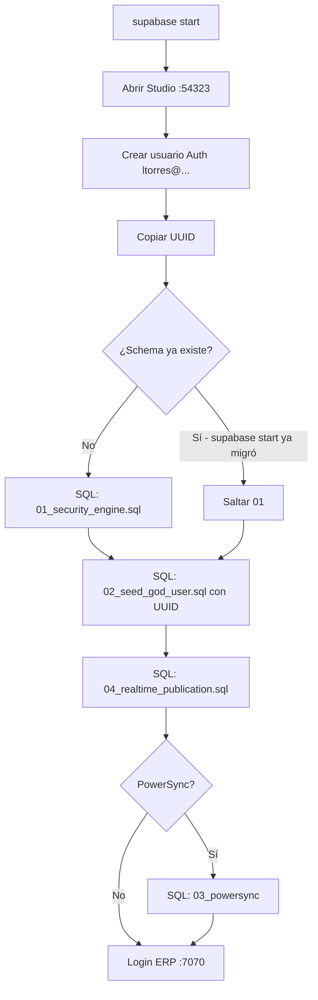

# Proceso: Supabase Studio local (post `supabase start`)

Guía operativa para levantar Supabase en Docker, abrir **Studio**, crear el usuario de desarrollo **`ltorres@pragmatadevs.com`** y aplicar las **migraciones manuales** `01` (Security Engine) y `02` (seed usuario dios) con el UUID de ese usuario.

> **Solo desarrollo local.** La contraseña documentada aquí es fija para la plantilla en tu máquina; no la uses en producción ni la subas a repositorios públicos de clientes.

> **Varias copias del template en un mismo PC:** cada carpeta tiene **su propia base** Docker, pero los puertos **no** cambian solos. Por defecto solo una copia puede usar `supabase start` a la vez (54321–54324). Para varias en paralelo y la tabla de **Studio por cliente**, lee [**supabase-local-copias-y-studio.md**](./supabase-local-copias-y-studio.md).

Si generás el repo con **Pragmata Factory** (`instantiate-stack.sh` / UI `serve-stack.mjs`), el servidor puede crear el usuario en **Auth** vía API admin local, aplicar el **seed del perfil god** con el mismo UUID y ajustar **puertos libres** en `config.toml` antes de `supabase start`. Credenciales por defecto: las de abajo (`ltorres@…` / `ltorres15`), o `PRAGMATA_LOCAL_GOD_EMAIL` / `PRAGMATA_LOCAL_GOD_PASSWORD`. Sigue aplicando el checklist de migraciones en base **vacía o antigua**; en una copia nueva del template, el script **`04_realtime_publication.sql`** (Realtime) suele ir ya integrado al final de `supabase/migrations/…_pragmata_schema.sql` (paso manual 7 de la tabla ya no hace falta). Detalle: README de `pragmata-factory`.

**Documentos relacionados:** [SETUP.md](./SETUP.md) (secciones 1.2 y 3.1), [PARA-INICIAR.md](./PARA-INICIAR.md), scripts en [`docs/database/`](../docs/database/).

---

## Resumen del flujo



| Paso | Qué | Archivo / URL |
|------|-----|----------------|
| 1 | Levantar stack local | `supabase start` |
| 2 | Abrir Studio | `supabase status` → **Studio URL** (default http://127.0.0.1:54323) |
| 3 | Crear usuario en Auth | email y contraseña fijos (abajo) |
| 4 | Copiar **User UID** | Authentication → Users |
| 5 | Migración 1 — schema | `docs/database/01_security_engine.sql` |
| 6 | Migración 2 — perfil god | `docs/database/02_seed_god_user.sql` (pegar UUID) |
| 7 | Migración 4 — Realtime | `docs/database/04_realtime_publication.sql` (**siempre**) |
| 8 | Migración 3 — PowerSync | `03_powersync_publication.sql` solo si `VITE_ENABLE_POWERSYNC=true` |
| 9 | Entrar al ERP | http://localhost:7070/login |

**Recuperar contraseña (local):** en login → *Forgot password?* → correo en [Mailpit](http://127.0.0.1:54324). Plantilla HTML: [`supabase/templates/recovery.html`](../supabase/templates/recovery.html) (cargada vía `config.toml` al `supabase start`). Guía completa: [auth-email-templates-local.md](./auth-email-templates-local.md). Tras cambiar plantillas o `config.toml`, ejecuta `supabase stop` y `supabase start`. Si el enlace falla revisa `site_url` = `http://localhost:7070`.

**Orden obligatorio:** primero el usuario en **Auth** (pasos 3–4), luego la migración **1** (si hace falta), y por último la **2** con el UUID. La migración 2 inserta en `public.profiles` usando el mismo `id` que `auth.users`.

---

## 0. Requisitos

- **Docker** en ejecución (Docker Desktop o equivalente).
- **Supabase CLI** instalada (`brew install supabase/tap/supabase`).
- Terminal en la **raíz del repo** (carpeta `supabase/` visible).

---

## 1. Levantar Supabase local

```bash
cd /ruta/al/PragmataDevApp-template
supabase start
```

La primera vez puede tardar (descarga de imágenes). Cuando termine:

```bash
supabase status
```

Anota para tu `.env` (no confundir puertos):

| Dato | Dónde va | Puerto |
|------|-----------|--------|
| **Project URL** / API | `VITE_SUPABASE_URL` | **54321** |
| **Publishable** / anon key | `VITE_SUPABASE_ANON_KEY` | — |
| **Studio** (solo navegador) | no va en `.env` | **54323** |

Ejemplo en `.env`:

```env
VITE_SUPABASE_URL=http://127.0.0.1:54321
VITE_SUPABASE_ANON_KEY=<clave de supabase status>
```

> Al hacer `supabase start`, la CLI aplica **2 migraciones**: `…20000_pragmata_schema.sql` (schema + Realtime + CMS) y `…20001…` (PowerSync). Si en Studio → **Table Editor** ya ves `profiles`, `entities`, `cms_pages`, **no vuelvas a pegar** `01_security_engine.sql` entero. Ve al paso 4 tras crear el usuario.
>
> Si el ERP muestra **«Error al cargar cms_pages»** en una base **antigua** (sin CMS en el baseline), ejecuta una vez en SQL Editor: `docs/database/05_cms_pages_ensure_legacy.sql`. Copia nueva: `supabase db reset` o `supabase migration up` tras `git pull`.

---

## 2. Abrir Supabase Studio

1. Con `supabase start` en estado **running**, abre en el navegador:

   **http://127.0.0.1:54323**

2. Es la UI local (equivalente al Dashboard de la nube). No uses el puerto **54323** como `VITE_SUPABASE_URL`; la API del ERP es **54321**.

Si no carga: `supabase status` y confirma que Studio está arriba; prueba `supabase stop` y `supabase start` de nuevo.

---

## 3. Crear el usuario en Authentication

Credenciales fijas de esta guía (desarrollo local):

| Campo | Valor |
|-------|--------|
| **Email** | `ltorres@pragmatadevs.com` |
| **Contraseña** | `ltorres15` |

Pasos en Studio:

1. Menú lateral → **Authentication**.
2. Pestaña **Users**.
3. **Add user** → **Create new user**.
4. Email: `ltorres@pragmatadevs.com`.
5. Password: `ltorres15`.
6. Activa **Auto Confirm User** (o equivalente) para poder iniciar sesión sin correo de confirmación.
7. Guarda / **Create user**.

### Copiar el UUID

1. En la lista de usuarios, abre el usuario `ltorres@pragmatadevs.com`.
2. Copia el **User UID** (formato UUID, p. ej. `a1b2c3d4-e5f6-7890-abcd-ef1234567890`).
3. Guárdalo en un bloc; lo usarás en la **migración 2**.

---

## 4. Migración 1 — Security Engine

**Archivo:** [`docs/database/01_security_engine.sql`](../database/01_security_engine.sql)

**Qué hace:** schema completo (Security Engine v3.0): tablas, RLS, funciones `is_god()`, `check_permission()`, módulos base, etc.

### Cuándo ejecutarla

| Situación | Acción |
|-----------|--------|
| Base **vacía** (sin tablas `profiles` / `teams`) | Ejecutar **sí** |
| Acabas de `supabase start` y ya existen esas tablas | **Omitir** (ya aplicó `supabase/migrations/20260111120000_pragmata_schema.sql`) |
| Error al ejecutar 02: `relation "profiles" does not exist` | Ejecutar **01** primero |

### Cómo ejecutarla

1. Studio → **SQL Editor** → **New query**.
2. Abre en tu editor el archivo `docs/database/01_security_engine.sql` del repo.
3. Copia **todo** el contenido y pégalo en el SQL Editor.
4. **Run** (o Ctrl/Cmd + Enter).
5. Debe terminar sin errores; al final del script va `NOTIFY pgrst, 'reload schema';` para refrescar PostgREST.

Si ves errores del tipo `already exists`, la migración 1 ya estaba aplicada: cancela y continúa con el paso 5.

---

## 5. Migración 2 — Seed usuario dios

**Archivo:** [`docs/database/02_seed_god_user.sql`](../database/02_seed_god_user.sql)

**Qué hace:** crea equipo `Pragmata Devs` (`is_platform_owner = true`), rol Super Admin y el perfil en `public.profiles` con `access_level = 'god'` vinculado al UUID de Auth.

### Editar el script antes de ejecutar

1. Abre `docs/database/02_seed_god_user.sql`.
2. Sustituye el UUID de ejemplo en el `INSERT` por el **User UID** de `ltorres@pragmatadevs.com` (paso 3).
3. Opcional: deja el email como `ltorres@pragmatadevs.com` (ya viene en el script).

Fragmento a modificar (línea del UUID):

```sql
SELECT 
  'PEGA-AQUI-TU-UUID-DE-STUDIO'::uuid,  -- ← User UID de ltorres@pragmatadevs.com
  'ltorres@pragmatadevs.com',
  'System Admin',
  ...
```

Ejemplo (UUID ficticio):

```sql
  'a1b2c3d4-e5f6-7890-abcd-ef1234567890'::uuid,
```

### Ejecutar en Studio

1. **SQL Editor** → nueva query.
2. Pega el script **ya editado** con tu UUID.
3. **Run**.

### Verificación rápida

En **SQL Editor**:

```sql
SELECT p.id, p.email, p.access_level, t.is_platform_owner
FROM public.profiles p
JOIN public.teams t ON t.id = p.team_id
WHERE p.email = 'ltorres@pragmatadevs.com';
```

Esperado: `access_level = 'god'` y `is_platform_owner = true` (entonces `public.is_god()` devuelve `true` para ese usuario).

---

## 6. Entrar al ERP

1. Asegura `.env` con URL **54321** y anon key de `supabase status`.
2. Arranca la app:

   ```bash
   pnpm dev
   ```

3. Navegador: **http://localhost:7070/login**
4. Email: `ltorres@pragmatadevs.com`
5. Contraseña: `ltorres15`

Deberías ver el sidebar completo (usuario dios sin bloqueos de RBAC en frontend).

### CMS del sitio (SEO)

- Ruta ERP: **SEO → Páginas del sitio** (`/seo/pages`). Activo por defecto; desactivar con `VITE_ENABLE_SITE_CMS=false` en `.env`.
- Tabla: `public.cms_pages` (landing `slug = home` + páginas Markdown).
- Si la lista no carga: `supabase migration up` (ver nota en §1). Usuario **god** o rol con permiso `page_seo_site_pages` → `read`.
- Opcional: `SUPABASE_SERVICE_ROLE_KEY=… pnpm db:sync` para alinear `sys_resources` con el código.

---

## 7. Problemas frecuentes

| Síntoma | Causa probable | Qué hacer |
|---------|----------------|-----------|
| Studio no abre en :54323 | Docker parado o `supabase start` falló | Abre Docker; `supabase stop` → `supabase start` |
| 401 en `profiles` tras login | Sesión JWT de **otra** instancia (nube vs local) | Cierra sesión en :7070, borra `localStorage` del origen o ventana privada |
| `duplicate key` al ejecutar 02 | Seed ya corrido antes | No repitas el script; revisa `profiles` con el SELECT de verificación |
| `profiles` no existe al ejecutar 02 | Falta migración 1 | Ejecuta `01_security_engine.sql` |
| `insert violates foreign key` en `profiles.id` | UUID incorrecto o usuario no creado en Auth | Crea el usuario en Authentication y vuelve a pegar el UID exacto |
| Errores `already exists` en 01 | Schema ya aplicado por CLI | Omite migración 1; solo 02 con UUID |
| **Error al cargar cms_pages** en `/seo/pages` | Tabla CMS ausente (DB antigua o migraciones sin aplicar) | `supabase migration up` en la raíz; verifica `SELECT slug FROM public.cms_pages;` |
| Lista CMS vacía sin error | Normal al inicio | Edita `home` o crea páginas; Astro usa la fila publicada en `/` |

---

## 8. Checklist

- [ ] `supabase start` OK
- [ ] Studio abierto en http://127.0.0.1:54323
- [ ] Usuario `ltorres@pragmatadevs.com` creado en Authentication (auto-confirmado)
- [ ] UUID copiado
- [ ] `01_security_engine.sql` ejecutado **solo si** la base no tenía schema
- [ ] `02_seed_god_user.sql` ejecutado con ese UUID
- [ ] `04_realtime_publication.sql` ejecutado (Realtime en todas las tablas de negocio)
- [ ] `03_powersync_publication.sql` solo si PowerSync
- [ ] `.env` apunta a `http://127.0.0.1:54321`
- [ ] Login en http://localhost:7070/login con `ltorres15`
- [ ] (Opcional) Forgot password → correo con plantilla Pragmata en Mailpit
- [ ] `supabase migration up` si faltaban migraciones (p. ej. CMS / `cms_pages`)
- [ ] (Opcional) **SEO → Páginas del sitio** carga sin error; existe fila `home` en `cms_pages`

---

## Referencia de archivos

| # | Archivo | Descripción |
|---|---------|-------------|
| 1 | `docs/database/01_security_engine.sql` | Security Engine — baseline schema |
| 2 | `docs/database/02_seed_god_user.sql` | Seed manual usuario dios (requiere UUID de Auth) |
| 3 | `docs/database/03_powersync_publication.sql` | Solo si `VITE_ENABLE_POWERSYNC=true` |
| 4 | `docs/database/04_realtime_publication.sql` | **Siempre** — publicación `supabase_realtime` |
| — | `supabase/templates/recovery.html` | Email «olvidé contraseña» (local + referencia cloud) |
| — | [auth-email-templates-local.md](./auth-email-templates-local.md) | Mailpit, `config.toml`, reinicio |
| — | [brand-assets.md](./brand-assets.md) | Icono SVG canónico ERP + Astro |
| — | [ui-z-index-layers.md](./ui-z-index-layers.md) | Capas UI (notificaciones, modales) |

Migraciones CLI (copia nueva): `…20000_pragmata_schema.sql` (schema + Realtime) y `…20001_pragmata_powersync_publication.sql` (opcional). Legacy CMS: `docs/database/05_cms_pages_ensure_legacy.sql`.

**Siguiente paso (solo local):** scripts RBAC + `supabase functions serve` → [**proceso-post-migraciones-scripts-y-funciones-local.md**](./proceso-post-migraciones-scripts-y-funciones-local.md).
