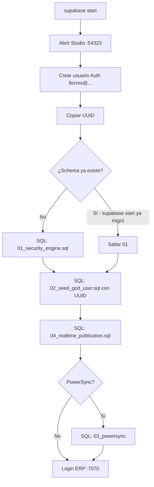

# Proceso: Supabase Studio local (post `supabase start`)

Guía operativa para levantar Supabase en Docker, abrir **Studio**, crear el usuario de desarrollo **`ltorres@pragmatadevs.com`** y aplicar las **migraciones manuales** `01` (Security Engine) y `02` (seed usuario dios) con el UUID de ese usuario.

> **Solo desarrollo local.** La contraseña documentada aquí es fija para la plantilla en tu máquina; no la uses en producción ni la subas a repositorios públicos de clientes.

**Documentos relacionados:** [SETUP.md](./SETUP.md) (secciones 1.2 y 3.1), [PARA-INICIAR.md](./PARA-INICIAR.md), scripts en [`docs/database/`](../docs/database/).

---

## Resumen del flujo



| Paso | Qué | Archivo / URL |
|------|-----|----------------|
| 1 | Levantar stack local | `supabase start` |
| 2 | Abrir Studio | http://127.0.0.1:54323 |
| 3 | Crear usuario en Auth | email y contraseña fijos (abajo) |
| 4 | Copiar **User UID** | Authentication → Users |
| 5 | Migración 1 — schema | `docs/database/01_security_engine.sql` |
| 6 | Migración 2 — perfil god | `docs/database/02_seed_god_user.sql` (pegar UUID) |
| 7 | Migración 4 — Realtime | `docs/database/04_realtime_publication.sql` (**siempre**) |
| 8 | Migración 3 — PowerSync | `03_powersync_publication.sql` solo si `VITE_ENABLE_POWERSYNC=true` |
| 9 | Entrar al ERP | http://localhost:7070/login |

**Orden obligatorio:** primero el usuario en **Auth** (pasos 3–4), luego la migración **1** (si hace falta), y por último la **2** con el UUID. La migración 2 inserta en `public.profiles` usando el mismo `id` que `auth.users`.

---

## 0. Requisitos

- **Docker** en ejecución (Docker Desktop o equivalente).
- **Supabase CLI** instalada (`brew install supabase/tap/supabase`).
- Terminal en la **raíz del repo** (carpeta `supabase/` visible).

---

## 1. Levantar Supabase local

```bash
cd /ruta/al/PragmataDevApp-template
supabase start
```

La primera vez puede tardar (descarga de imágenes). Cuando termine:

```bash
supabase status
```

Anota para tu `.env` (no confundir puertos):

| Dato | Dónde va | Puerto |
|------|-----------|--------|
| **Project URL** / API | `VITE_SUPABASE_URL` | **54321** |
| **Publishable** / anon key | `VITE_SUPABASE_ANON_KEY` | — |
| **Studio** (solo navegador) | no va en `.env` | **54323** |

Ejemplo en `.env`:

```env
VITE_SUPABASE_URL=http://127.0.0.1:54321
VITE_SUPABASE_ANON_KEY=<clave de supabase status>
```

> Al hacer `supabase start`, la CLI suele aplicar ya las migraciones versionadas en `supabase/migrations/` (equivalente al contenido de `01_security_engine.sql`). Si en Studio → **Table Editor** ves tablas como `profiles`, `teams`, `entities`, **no vuelvas a ejecutar** la migración 1 (evitas errores de “relation already exists”). En ese caso ve directo al paso 4 tras crear el usuario.

---

## 2. Abrir Supabase Studio

1. Con `supabase start` en estado **running**, abre en el navegador:

   **http://127.0.0.1:54323**

2. Es la UI local (equivalente al Dashboard de la nube). No uses el puerto **54323** como `VITE_SUPABASE_URL`; la API del ERP es **54321**.

Si no carga: `supabase status` y confirma que Studio está arriba; prueba `supabase stop` y `supabase start` de nuevo.

---

## 3. Crear el usuario en Authentication

Credenciales fijas de esta guía (desarrollo local):

| Campo | Valor |
|-------|--------|
| **Email** | `ltorres@pragmatadevs.com` |
| **Contraseña** | `ltorres15` |

Pasos en Studio:

1. Menú lateral → **Authentication**.
2. Pestaña **Users**.
3. **Add user** → **Create new user**.
4. Email: `ltorres@pragmatadevs.com`.
5. Password: `ltorres15`.
6. Activa **Auto Confirm User** (o equivalente) para poder iniciar sesión sin correo de confirmación.
7. Guarda / **Create user**.

### Copiar el UUID

1. En la lista de usuarios, abre el usuario `ltorres@pragmatadevs.com`.
2. Copia el **User UID** (formato UUID, p. ej. `a1b2c3d4-e5f6-7890-abcd-ef1234567890`).
3. Guárdalo en un bloc; lo usarás en la **migración 2**.

---

## 4. Migración 1 — Security Engine

**Archivo:** [`docs/database/01_security_engine.sql`](../database/01_security_engine.sql)

**Qué hace:** schema completo (Security Engine v3.0): tablas, RLS, funciones `is_god()`, `check_permission()`, módulos base, etc.

### Cuándo ejecutarla

| Situación | Acción |
|-----------|--------|
| Base **vacía** (sin tablas `profiles` / `teams`) | Ejecutar **sí** |
| Acabas de `supabase start` y ya existen esas tablas | **Omitir** (ya aplicó `supabase/migrations/20260111120000_pragmata_schema.sql`) |
| Error al ejecutar 02: `relation "profiles" does not exist` | Ejecutar **01** primero |

### Cómo ejecutarla

1. Studio → **SQL Editor** → **New query**.
2. Abre en tu editor el archivo `docs/database/01_security_engine.sql` del repo.
3. Copia **todo** el contenido y pégalo en el SQL Editor.
4. **Run** (o Ctrl/Cmd + Enter).
5. Debe terminar sin errores; al final del script va `NOTIFY pgrst, 'reload schema';` para refrescar PostgREST.

Si ves errores del tipo `already exists`, la migración 1 ya estaba aplicada: cancela y continúa con el paso 5.

---

## 5. Migración 2 — Seed usuario dios

**Archivo:** [`docs/database/02_seed_god_user.sql`](../database/02_seed_god_user.sql)

**Qué hace:** crea equipo `Pragmata Devs` (`is_platform_owner = true`), rol Super Admin y el perfil en `public.profiles` con `access_level = 'god'` vinculado al UUID de Auth.

### Editar el script antes de ejecutar

1. Abre `docs/database/02_seed_god_user.sql`.
2. Sustituye el UUID de ejemplo en el `INSERT` por el **User UID** de `ltorres@pragmatadevs.com` (paso 3).
3. Opcional: deja el email como `ltorres@pragmatadevs.com` (ya viene en el script).

Fragmento a modificar (línea del UUID):

```sql
SELECT 
  'PEGA-AQUI-TU-UUID-DE-STUDIO'::uuid,  -- ← User UID de ltorres@pragmatadevs.com
  'ltorres@pragmatadevs.com',
  'System Admin',
  ...
```

Ejemplo (UUID ficticio):

```sql
  'a1b2c3d4-e5f6-7890-abcd-ef1234567890'::uuid,
```

### Ejecutar en Studio

1. **SQL Editor** → nueva query.
2. Pega el script **ya editado** con tu UUID.
3. **Run**.

### Verificación rápida

En **SQL Editor**:

```sql
SELECT p.id, p.email, p.access_level, t.is_platform_owner
FROM public.profiles p
JOIN public.teams t ON t.id = p.team_id
WHERE p.email = 'ltorres@pragmatadevs.com';
```

Esperado: `access_level = 'god'` y `is_platform_owner = true` (entonces `public.is_god()` devuelve `true` para ese usuario).

---

## 6. Entrar al ERP

1. Asegura `.env` con URL **54321** y anon key de `supabase status`.
2. Arranca la app:

   ```bash
   pnpm dev
   ```

3. Navegador: **http://localhost:7070/login**
4. Email: `ltorres@pragmatadevs.com`
5. Contraseña: `ltorres15`

Deberías ver el sidebar completo (usuario dios sin bloqueos de RBAC en frontend).

---

## 7. Problemas frecuentes

| Síntoma | Causa probable | Qué hacer |
|---------|----------------|-----------|
| Studio no abre en :54323 | Docker parado o `supabase start` falló | Abre Docker; `supabase stop` → `supabase start` |
| 401 en `profiles` tras login | Sesión JWT de **otra** instancia (nube vs local) | Cierra sesión en :7070, borra `localStorage` del origen o ventana privada |
| `duplicate key` al ejecutar 02 | Seed ya corrido antes | No repitas el script; revisa `profiles` con el SELECT de verificación |
| `profiles` no existe al ejecutar 02 | Falta migración 1 | Ejecuta `01_security_engine.sql` |
| `insert violates foreign key` en `profiles.id` | UUID incorrecto o usuario no creado en Auth | Crea el usuario en Authentication y vuelve a pegar el UID exacto |
| Errores `already exists` en 01 | Schema ya aplicado por CLI | Omite migración 1; solo 02 con UUID |

---

## 8. Checklist

- [ ] `supabase start` OK
- [ ] Studio abierto en http://127.0.0.1:54323
- [ ] Usuario `ltorres@pragmatadevs.com` creado en Authentication (auto-confirmado)
- [ ] UUID copiado
- [ ] `01_security_engine.sql` ejecutado **solo si** la base no tenía schema
- [ ] `02_seed_god_user.sql` ejecutado con ese UUID
- [ ] `04_realtime_publication.sql` ejecutado (Realtime en todas las tablas de negocio)
- [ ] `03_powersync_publication.sql` solo si PowerSync
- [ ] `.env` apunta a `http://127.0.0.1:54321`
- [ ] Login en http://localhost:7070/login con `ltorres15`

---

## Referencia de archivos

| # | Archivo | Descripción |
|---|---------|-------------|
| 1 | `docs/database/01_security_engine.sql` | Security Engine — baseline schema |
| 2 | `docs/database/02_seed_god_user.sql` | Seed manual usuario dios (requiere UUID de Auth) |
| 3 | `docs/database/03_powersync_publication.sql` | Solo si `VITE_ENABLE_POWERSYNC=true` |
| 4 | `docs/database/04_realtime_publication.sql` | **Siempre** — publicación `supabase_realtime` |

Equivalente versionado (CLI): `…20000_pragmata_schema.sql`, `…20001_pragmata_powersync_publication.sql`, `…20002_pragmata_realtime_publication.sql`.

**Siguiente paso (solo local):** scripts RBAC + `supabase functions serve` → [**proceso-post-migraciones-scripts-y-funciones-local.md**](./proceso-post-migraciones-scripts-y-funciones-local.md).
